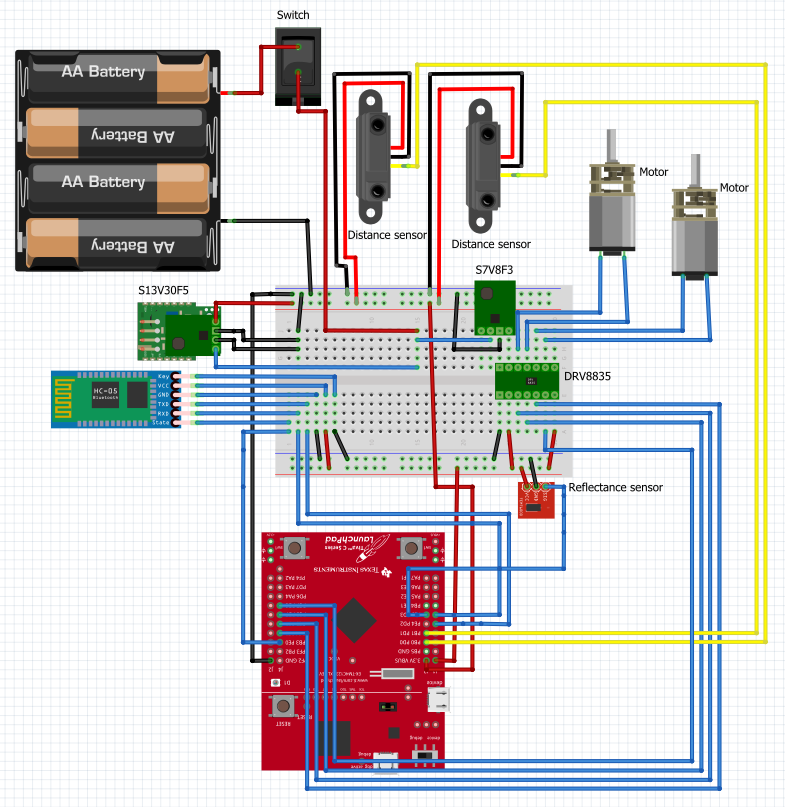

# ECE4437-Robot

Caleb Ballard, Aruba Bukhari

## Intro

This code is for a robot which was built for ECE 4437 at the University of Houston. The objective of the robot is to navigate a maze.

## Hardware

The core component of this project was a Texas Instruments Tiva C (EK-TM4C123GXL). THe following wiring diagram shows the general layout of all components:

## Demo Video

In [this video](https://photos.app.goo.gl/ea5unZCozoSsS7tX8), You can see the basic operation of the robot. Here is what happens:

- By default, the robot is in an idle/stopped state when powered on.
- When the "clear stop" command is sent from the laptop to the robot over Bluetooth, the robot operation starts.
- If the robot sees a thin black line (represented by one piece of electrical tape), it will start sending distance sensor data back to the computer.
- If the robot sees a thick black line (represented by two pieces of electrical tape), it will revert to the stopped state and print the time it measured to navigate the maze.

## Projects

There are two projects in this repository. You can open this repository as a Code Composer 10 Workspace.

- **bt_test**: This was used to test the Bluetooth capabilities over UART. Our team was responsible for presenting the functionality to the class as part of a series of technical presentations given by all the other groups in the class.
- **wall-e**: Our robot code. We called it WALL-E since we originally wanted to 3D-print a WALL-E body and put it on the robot, but there turned out to be not enough space for turning when you put a square body in the maze!
